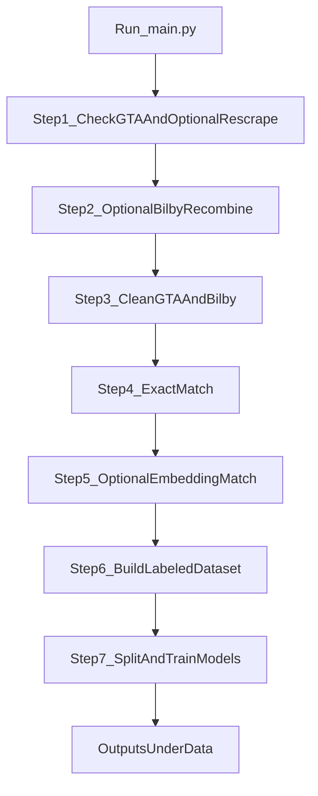

# Bilby Project: Daily Trade Alert Project

This project aims to help Bilby identify **important trade-related policies** through a full data-to-model pipeline.

## Scope of This Repository (China Part)

This README and pipeline implementation focus on the **China part** of the Bilby project.

Before running `main.py`, make sure the following input folders are **not empty**:

- `Data/Bilby_data_raw`
- `Data/China_GTA_Downloaded`

For GTA input files, data must be downloaded from the official GTA website and placed under `Data/China_GTA_Downloaded` (for example, `interventions.xlsx`).

The China-part pipeline in this repository:

1. prepares GTA and Bilby datasets,
2. performs exact and optional embedding-based matching,
3. builds a labeled dataset,
4. splits data into train/valid/test,
5. trains two classifiers (TF-IDF+LogReg and BGE-M3+LogReg).

The main entrypoint is `main.py`.

## What This Project Produces

Primary outputs are generated under `Data/`:

- cleaned GTA and Bilby parquet files,
- exact-match and embedding-match artifacts,
- a final labeled dataset (`null_signal_dataset.parquet`),
- a fixed time-based split dataset (`fixedsplit_dataset.parquet`),
- training/evaluation metrics printed to terminal.

## Architecture Overview



## Prerequisites

### Python

- Recommended: Python `3.10+`
- This project uses modern type hints and path handling (`Path(__file__)` based paths).

### System Tools

- Google Chrome (required if you run GTA scraping).
- Selenium-compatible Chrome/driver environment (Selenium Manager is used by default).

### Optional GPU

- Embedding scripts default to `cuda` and automatically fall back to `cpu` if CUDA is unavailable.
- CPU-only execution is supported, but embedding steps can be slower.

## Installation

Run from repository root:

```bash
python -m venv .venv
```

Activate environment:

- Windows PowerShell:

```powershell
.venv\Scripts\Activate.ps1
```

- macOS/Linux:

```bash
source .venv/bin/activate
```

Install dependencies (preferred: use `requirements.txt`):

```bash
pip install -U pip
pip install -r requirements.txt
```

Fallback (manual install, if needed):

```bash
pip install pandas numpy polars pyarrow openpyxl scikit-learn scipy jieba selenium beautifulsoup4 sentence-transformers torch
```

## Data Directory Layout

Prepare your data under this structure (relative paths):

```text
Data/
├── China_GTA_Downloaded/
│   └── interventions.xlsx
├── China_GTA_Source/
│   ├── interventions_sources.parquet
│   └── interventions_sources_cleaned.parquet
├── Bilby_data_raw/
│   ├── 2025/<month>/*.parquet
│   └── 2026/<month>/*.parquet
├── Bilby_data_fixed/
│   ├── Bilby_2025_2026_combined.parquet
│   └── Bilby_2025_2026_combined_cleaned.parquet
├── match_outputs/
│   ├── combined_match_matched.parquet
│   ├── combined_match_bilby_unmatched.parquet
│   ├── combined_match_gta_unmatched.parquet
│   ├── gta_not_in_time_range_gta_not_in_time_range.parquet
│   ├── embedding_match_matched_records_matched.parquet
│   ├── embedding_match_matched_records_bilby_unmatched.parquet
│   ├── embedding_match_matched_records_gta_unmatched.parquet
│   └── embedding_cache/
└── dataset_construction/
    ├── null_signal_dataset.parquet
    └── fixedsplit_dataset.parquet
```

Model assets (optional local model):

```text
models/
└── bge-m3/
```

If `models/bge-m3` is missing or incomplete, scripts can fall back to remote model `BAAI/bge-m3`.

## One-Click Run

```bash
python main.py
```

`main.py` runs all downstream scripts with project-root working directory for portability.

## End-to-End Notebook (Data Collection)

For a step-by-step reproducible walkthrough of GTA + Bilby data collection and cleaning, use:

- `data_collection_end_to_end.ipynb` (at repository root)

This notebook:

- prints input/output dataset metadata and sample rows at each step,
- keeps GTA scrape rerun code commented by default (uncomment only when needed),
- shows before/after comparisons for GTA and Bilby cleaning outputs.

## Detailed Pipeline Steps

| Step | Script | Required | Purpose | Main Outputs |
|---|---|---|---|---|
| 1 | `code/data_preprocessing/GTA_Source_Scrape.py` | Optional | Scrape GTA source records from State Act URLs | `Data/China_GTA_Source/interventions_sources.xlsx`, `.parquet` |
| 2 | `code/data_preprocessing/Bilby_data_combine.py` | Optional | Merge Bilby 2025/2026 raw monthly parquet files | `Data/Bilby_data_fixed/Bilby_2025_2026_combined.parquet` |
| 3 | `code/data_preprocessing/GTA_Bilby_clean.py` | Yes | Normalize titles/URLs/date fields, deduplicate (GTA by `source_url`, Bilby by `article_url`), and export cleaned datasets | cleaned GTA/Bilby parquet + Excel |
| 4 | `code/data_match/exact_match.py` | Yes | URL and title exact matching within date window | `Data/match_outputs/combined_match_*.parquet` and Excel reports |
| 5 | `code/data_match/embedding_match.py` | Optional | Embedding-based matching for higher recall | `Data/match_outputs/embedding_match_matched_records_*.parquet` |
| 6 | `code/Model/null_signal_dataset.py` | Yes | Build labeled dataset from match outputs | `Data/dataset_construction/null_signal_dataset.parquet` |
| 7a | `code/Model/fixed_split.py` | Yes | Time-based split into train/valid/test | `Data/dataset_construction/fixedsplit_dataset.parquet` |
| 7b | `code/Model/TF-IDF_title+logistic_regression.py` | Yes | TF-IDF + Logistic Regression training/evaluation | Metrics in terminal |
| 7c | `code/Model/BERT_title.py` | Yes | BGE-M3 embeddings + Logistic Regression | Metrics in terminal |

## Defaults and Optional Branches

In `main.py`, these prompts default to **No** (press Enter = skip):

- re-scrape GTA Source,
- recombine Bilby 2025+2026,
- run embedding match.

This means the pipeline can reuse existing artifacts if they are already present.

## Interactive Prompts You Will See

### `main.py`

- `Do you want to re-scrape GTA Source? [y/n]:`
- `Do you want to recombine Bilby 2025+2026 data? [y/n]:`
- `Do you want to run embedding match? [y/n]:`

Accepted yes/no values include English and Chinese variants.

### GTA scrape (`GTA_Source_Scrape.py`)

- In manual-login mode, browser opens and waits for:
  - `Please sign in to GTA in the browser, then press Enter to continue...`

### Exact match (`exact_match.py`)

- If running in an interactive TTY, it prompts for:
  - start date (`YYYY-MM-DD`, default `2025-06-01`),
  - end date (`YYYY-MM-DD`, default `2026-03-01`).

### Label building (`null_signal_dataset.py`)

You will choose:

1. base source (`combine` vs `embedding` outputs),
2. whether to include GTA unmatched and/or out-of-period GTA rows as label=1 additions.

## Configuration

### GTA scrape environment variables

- `GTA_SELENIUM_MANUAL_LOGIN` (default `1`)
- `GTA_SELENIUM_HEADLESS` (default `0`)
- `GTA_SELENIUM_DEBUG` (default `0`)

### Date window defaults

The default date window across cleaning/matching scripts is:

- start: `2025-06-01` (inclusive)
- end: `2026-03-01` (exclusive)

You can override via CLI args on individual scripts.

## Script-Level CLI Examples

Run individual steps manually if needed:

```bash
python code/data_preprocessing/Bilby_data_combine.py --bilby-dir Data/Bilby_data_raw --output Data/Bilby_data_fixed/Bilby_2025_2026_combined.parquet
python code/data_preprocessing/GTA_Bilby_clean.py --gta-input Data/China_GTA_Source/interventions_sources.parquet --bilby-input Data/Bilby_data_fixed/Bilby_2025_2026_combined.parquet
python code/data_match/exact_match.py --gta-input Data/China_GTA_Source/interventions_sources_cleaned.parquet --bilby-input Data/Bilby_data_fixed/Bilby_2025_2026_combined_cleaned.parquet
python code/data_match/embedding_match.py --device cpu
python code/Model/null_signal_dataset.py --match-dir Data/match_outputs --output-dir Data/dataset_construction
python code/Model/fixed_split.py --input Data/dataset_construction/null_signal_dataset.parquet
python "code/Model/TF-IDF_title+logistic_regression.py" --input Data/dataset_construction/fixedsplit_dataset.parquet
python code/Model/BERT_title.py --input Data/dataset_construction/fixedsplit_dataset.parquet --device cpu
```

## Portability Notes (Different Devices)

This project is designed to be machine-portable:

- path resolution is based on file location (`Path(__file__)`), not hardcoded personal directories,
- all pipeline defaults use relative project paths (`Data/`, `code/`, `models/`),
- `main.py` invokes child scripts with project root as working directory.

As long as dependencies are installed and the expected `Data/` inputs exist, the same code runs on other devices.

## Troubleshooting

### 1) Missing input files

- `Data/China_GTA_Downloaded/interventions.xlsx` is required for scrape mode.
- Bilby raw monthly parquet files must exist under `Data/Bilby_data_raw/2025/*/*.parquet` and/or `2026/*/*.parquet`.

### 2) GTA scrape login/timeouts

- Ensure Chrome opens successfully and GTA login is complete before pressing Enter.
- If login is not confirmed, script will keep prompting.

### 3) Step 6 fails even when embedding step is skipped

Current behavior: `null_signal_dataset.py` loads combine and embedding parquet files at startup.
Therefore, if embedding outputs are missing, Step 6 can fail even when you skipped Step 5 in `main.py`.

Practical fix:

- either run embedding step at least once, or
- place required embedding parquet files in `Data/match_outputs/`.

### 4) Local model issues (`models/bge-m3`)

- If local model files are incomplete, embedding/model scripts may fail local load and attempt remote fallback.
- Ensure internet access for remote fallback, or provide a complete local `models/bge-m3`.

### 5) CUDA unavailable

- Use `--device cpu` for `embedding_match.py` and `BERT_title.py`.
- CPU mode is supported but slower.

### 6) Training errors about labels/splits

- Ensure `fixedsplit_dataset.parquet` includes required columns: `dataset`, `title`, `label`, `source_url`.
- Ensure train split has both classes (`label` contains both `0` and `1`).

## Reproducibility Checklist

Before running on a new machine:

1. clone repository and enter project root,
2. create/activate virtual environment,
3. install dependencies,
4. prepare required `Data/` inputs,
5. verify optional `models/bge-m3` availability,
6. run `python main.py`.
